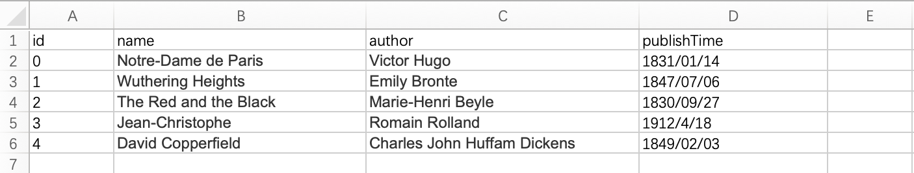

# EQUAL

[]()
[](https://github.com/gnahZ-eH/equal/actions)

**READING <font color='green' size='5'>E</font>XCEL(CSV) FILES IN A S<font color='green' size='5'>Q</font>L- STYLE AND RET<font color='green' size='5'>U</font>RN <font color='green' size='5'>A</font>N OBJECT <font color='green' size='5'>L</font>IST AS RESULT.**

## What is EQUAL ?
EQUAL is a small lib that can operate excel files in a sql-style. It includes the basic operations like read, write, update and delete.

---

## How to use ?
### PREPARE
- We need a bean class which is a model of excel or csv file. For example, if we want to operate an excel file that includes some books, we need a Book class with some annotations, the index should start from 0 and should match the order in excel/csv files.
    ```java
    public class Book {

        @Column(name = "id", index = 0)
        public int id;

        @Column(name = "name", index = 1)
        public String name;

        @Column(name = "author", index = 2)
        public String author;

        @Column(name = "publishTime", index = 3)
        public LocalDate publishTime;

        public Book() {}

        public Book(int id, String name, String author, LocalDate publishTime) {
            this.id = id;
            this.name = name;
            this.author = author;
            this.publishTime = publishTime;
        }
    }
    ```
- ⚠️ The empty constructor is mandatory❗

- The excel file like:
    

---

### READ 
- The code should like:
    ```java
    List<Book> books = Selector
        .select(Book.class)
        .from(new File("src/test/resources/Book.xlsx"))
        .where()
        .executeQuery();
    ```
-  📌 There is another function `where()` with Parameters: `[int rowStartIndex, int numberOfRows]`, the `rowStartIndex` is where you start to read in excel file(begin from `1`) and should greater or equal to `2`.

### WRITE
- The code should like:
    ```java
    Inserter
        .insert(Book.class)
        .into(new File("src/test/resources/Book.csv"))
        .values(books)
        .range()
        .flush();
    ```
-  📌️ There is another function `range()` with Parameters: `[int rowStartIndex, int numberOfRows]`, the `rowStartIndex` is where you start to write into the file and should greater or equal to `1`.
-  📌 And for the file title, it follows this rule:
   | Source File              | Column Name            |
   | ------------------------ | ---------------------- |
   | Source File Exist        | Not Insert Column Name |
   | Source File Do Not Exist | Insert Column Name     |
-  The result should like:
    ```csv
    id,name,author,publishTime
    0,Notre-Dame de Paris,Victor Hugo,1831/01/14
    1,Wuthering Heights,Emily Bronte,1847/07/06
    2,The Red and the Black,Marie-Henri Beyle,1830/09/27
    3,Jean-Christophe,Romain Rolland,1912/04/18
    4,David Copperfield,Charles John Huffam Dickens,1849/02/03
    ```
### UPDATE
### DELETE